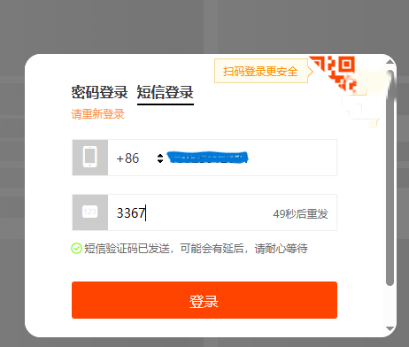
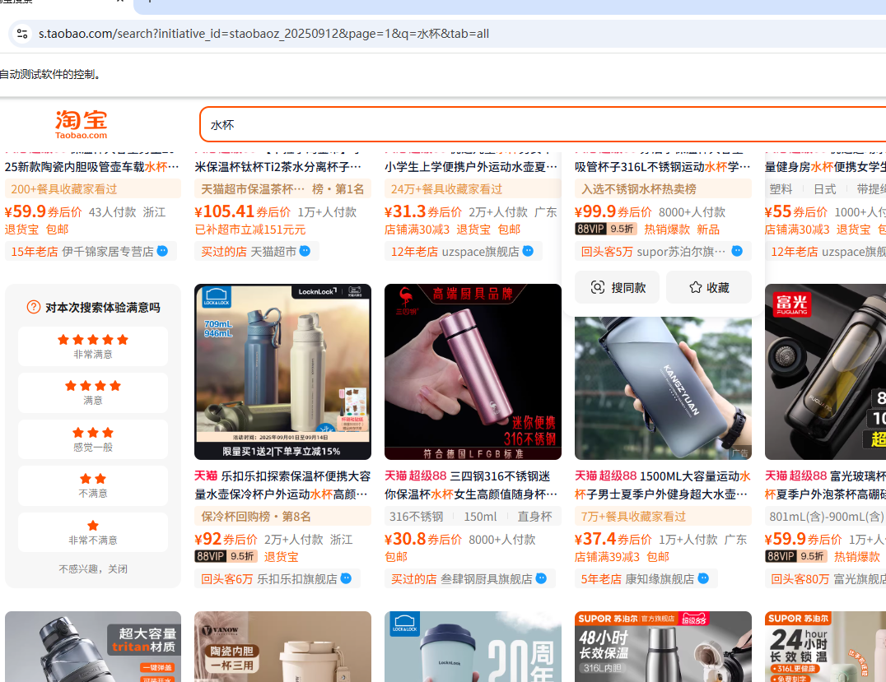
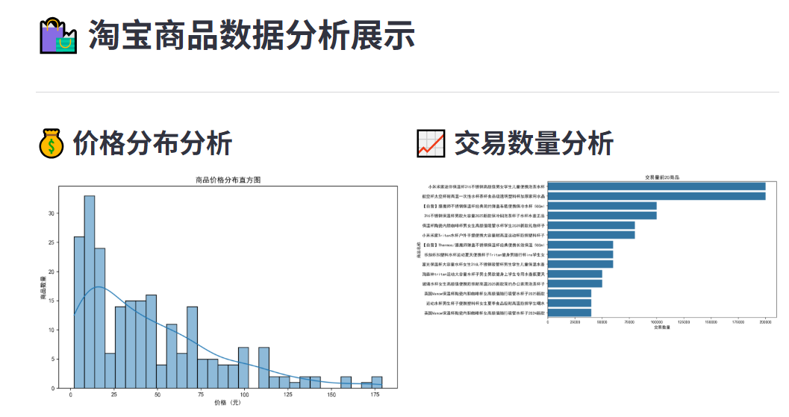
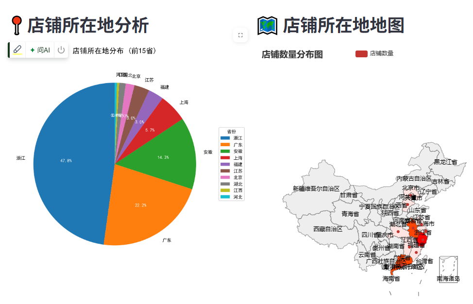

# 淘宝数据爬取与可视化项目
## Project Overview
First, use Selenium to automatically scrape product information from Taobao and JD for the same items. Then, process and clean the collected data. Next, analyze the same products based on indicators such as price, sales volume, and place of origin. Finally, use tools like Seaborn, Pyecharts, and Streamlit to visualize and display the comparison differences between Taobao and JD through charts.

## Main Features
1.Data-crawling module: uses Selenium to drive the browser automatically and locates key elements such as price and sales volume on Taobao/JD product pages via XPath.
2.Data-cleaning module: deduplicates the raw data, handles missing values, and standardizes formats (e.g., unifying currency units).
3.Analysis & comparison module: calculates the price-gap percentage for the same product across the two platforms, and summarizes sales-volume distribution and origin concentration.
4.Visualization module: generates statistical distribution plots with Seaborn and produces interactive comparison bar charts with Pyecharts.
5.Interactive interface: a Streamlit-powered dashboard that lets users filter product categories and choose sorting dimensions.

本项目旨在通过selenium模拟真实的用户访问taobao网站，绕过登录限制和反爬策略，爬取商品信息等数据。并对数据进行清洗和分析，以图表方式展现出来。

## 项目结构

- `scrape_taobao.py`: 负责数据爬取、清洗和保存
- `dashboard.py`: 负责数据可视化展示

## 项目概述
数据爬取模块：使用Selenium自动化控制浏览器，通过XPath定位淘宝/京东商品页面的价格、销量等关键元素
数据清洗模块：对爬取的原始数据进行去重、缺失值处理、格式标准化（如统一货币单位）
分析对比模块：计算同商品在两个平台的价差百分比，统计销量分布和产地集中度
可视化模块：通过Seaborn生成统计分布图，Pyecharts制作交互式对比柱状图
交互界面：Streamlit构建可视化看板，支持筛选商品类别和排序维度

## 主要功能

### 1. 数据爬取模块 (scrape_taobao.py)

该模块主要完成以下任务：

#### 手动登入并输入验证码



#### 数据爬取

使用自动化工具（如Selenium或Playwright）访问淘宝网站，搜索指定类别的商品。设置请求头，模拟用户页面滚动等操作，页面滚动操作确保所有商品都能被加载出来。
等待当前页面全部加载完后，再延时跳转到下一面。
主要代码实现：

```python
# 配置并初始化浏览器，设置开发者模式以绕过网站检测。
def init_browser():
    # 配置 Chrome 选项
    chrome_options = Options()
    chrome_options.accept_insecure_certs = True
    user_agent = '''Mozilla/5.0 (Windows NT 10.0; Win64; x64) AppleWebKit/537.36 (KHTML, like Gecko) Chrome/91.0.4472.124 Safari/537.36'''
    chrome_options.add_argument(f'user-agent={user_agent}')
    
    # 配置 Chrome 驱动路径
    chrome_driver = f'{current_directory}\\selenium_driver\\chromedriver.exe'
    service = Service(chrome_driver)
    browser = webdriver.Chrome(service=service, options=chrome_options)
    
    # 设置开发者模式，防止被检测
    browser.execute_cdp_cmd('Page.addScriptToEvaluateOnNewDocument', {
        'source': '''
            Object.defineProperty(navigator, 'webdriver', {
                get: () => undefined
            })
        '''
    })
    return browser
```

提取商品信息，包括但不限于：
- 商品标题
- 价格
- 销量
- 店铺信息
- 商品图片
- 交易数量
- 店铺所在地



#### 数据清洗和处理

对爬取的原始数据进行清洗和格式化：

```python
def clean_data(data):
    # 清理价格数据
    data['价格'] = data['价格'].astype(str).apply(lambda x: re.findall(r'\d+\.?\d*', x))
    data['价格'] = data['价格'].apply(lambda x: float(x[0]) if len(x) > 0 else 0)
    
    # 清理销量数据
    def extract_sales(sales_str):
        sales_str = str(sales_str)
        if '万' in sales_str:
            num = re.findall(r'\d+\.?\d*', sales_str)
            if num:
                return float(num[0]) * 10000
        else:
            num = re.findall(r'\d+', sales_str)
            if num:
                return float(num[0])
        return 0
    
    data['交易数量'] = data['交易数量'].apply(extract_sales)
    return data
```

#### 数据保存

将清洗后的数据保存到本地文件（如CSV或JSON格式），并下载商品图片：

```python
# 下载图片并自动检测WebP格式转换为JPEG

def download_image(image_url):
    try:
        # 处理相对URL
        if image_url.startswith('//'):
            image_url = 'https:' + image_url
        elif not image_url.startswith('http'):
            return None

        # 发送请求下载图片
        headers = {
            'User-Agent': 'Mozilla/5.0 (Windows NT 10.0; Win64; x64) AppleWebKit/537.36 (KHTML, like Gecko) Chrome/91.0.4472.124 Safari/537.36'
        }
        response = requests.get(image_url, headers=headers, timeout=10)
        response.raise_for_status()

        # 检查图片格式，如果是WebP则转换为JPEG
        image_data = BytesIO(response.content)
        try:
            image_pic = PILImage.open(image_data)
            if image_pic.format == 'WEBP':
                # 转换为JPEG格式
                image_pic = image_pic.convert('RGB')
                # 重新生成BytesIO对象
                converted_image_data = BytesIO()
                image_pic.save(converted_image_data, format='JPEG')
                # 重置指针位置
                converted_image_data.seek(0)
                # 使用转换后的数据
                image_data = converted_image_data
        except Exception as e:
            print(f'图片格式检查失败: {str(e)}')

        # 生成唯一文件名并保存
        filename = f'{uuid.uuid4()}.jpg'
        filepath = os.path.join(IMG_SAVE_DIR, filename)

        with open(filepath, 'wb') as f:
            f.write(image_data.getvalue())
        return filepath
    except Exception as e:
        print(f'图片下载失败: {str(e)}')
        return None
```

### 2. 数据展示模块 (dashboard.py)

该模块主要完成以下任务：

#### 数据加载与分析

```python
# 读取Excel数据
@st.cache_data
def load_data(file_path):
    df = pd.read_excel(file_path)
    # 数据清洗
    df = clean_price_data(df)
    df = clean_sales_data(df)
    df = extract_province_data(df)
    return df

# 提取省份数据

def extract_province_data(df):
    df['省份'] = df['店铺所在地'].astype(str).apply(lambda x: x.split()[0] if x else "未知")
    return df
```

#### 数据可视化

使用Streamlit和Seaborn创建交互式仪表板：

```python
def plot_price_distribution(df):
    """绘制价格分布图"""
    st.header("💰 价格分布分析")
    fig, ax = plt.subplots(figsize=(10, 6))
    sns.histplot(data=df, x='价格', bins=30, kde=True, ax=ax)
    ax.set_title('商品价格分布直方图')
    ax.set_xlabel('价格 (元)')
    ax.set_ylabel('商品数量')
    st.pyplot(fig)

# 绘制交易量前20商品图
def plot_top_sales(df):
    st.header("📈 交易数量分析")
    fig, ax = plt.subplots(figsize=(10, 6))
    # 取交易量前20的商品
    top_sales = df.nlargest(20, '交易数量')
    sns.barplot(data=top_sales, x='交易数量', y='商品简介', ax=ax)
    ax.set_title('交易量前20商品')
    ax.set_xlabel('交易数量')
    ax.set_ylabel('商品名称')
    st.pyplot(fig)
```



## 使用说明

1. 运行数据爬取脚本：

```bash
python scrape_taobao.py
```

1. 启动数据展示仪表板：

```bash
streamlit run dashboard.py
```
## python 3.11
### 需下载selenium模块使用的Chrome驱动:chromedriver.exe

## 依赖库

- Selenium 或 Playwright (用于网页自动化)
- Requests (用于图片下载)
- Pillow (用于图片处理)
- Pandas (用于数据处理)
- Streamlit (用于创建仪表板)
- Seaborn (用于数据可视化)
- PyECharts (用于地图展示)

## 注意事项

- 请遵守网站的robots.txt协议和使用条款
- 合理控制爬取频率，避免对网站造成过大压力
- 确保已安装所有必要的依赖库
- 根据需要配置图片保存路径和其他参数